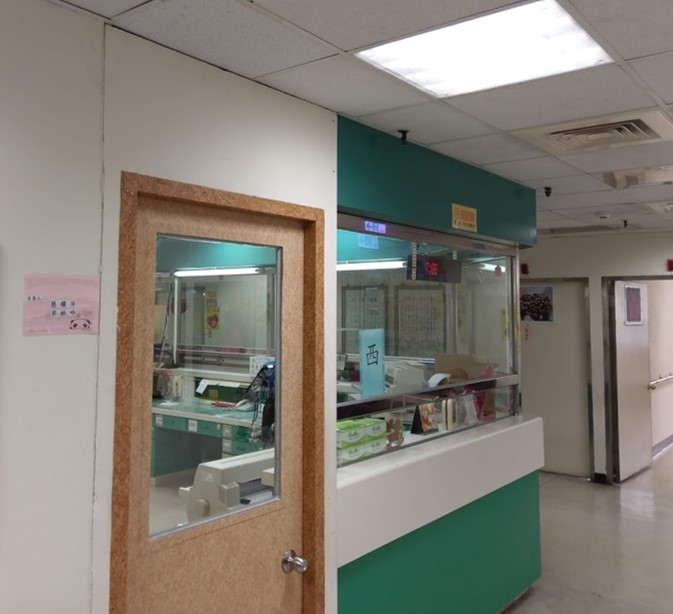

# 2. 佈署注意事項

## ​天線須直立或倒立

伺服器、收發器、中繼器之天線，須與**地板或天花板呈90度**。

## 天線周圍保持開放，避免遮蔽

* 避免天線靠近水泥牆壁
* 避免天線接觸金屬物
* 避免天線安裝在螢幕後面 

## 收發器安裝位置儘量遠離床架馬達

安裝位置遠端馬達，避免干擾。

## 中繼器安裝位置儘量遠離機房

中繼器經常安裝在走廊上，若位置可選擇，儘量離遠機房。\(如洗衣間、熱水鍋爐間、茶水間等\)

## 有玻璃間隔要縮短安裝距離

如果安裝伺服器的護理站，與病區間有玻璃完全間隔，安裝距離需縮短為建議值的**1/2**。\([伺服器與智慧墊的安裝距離](https://billy0727.gitbook.io/guideline/~/edit/drafts/-LVGNiMc0LLwhUULwlYP/zhi-ju)\)

