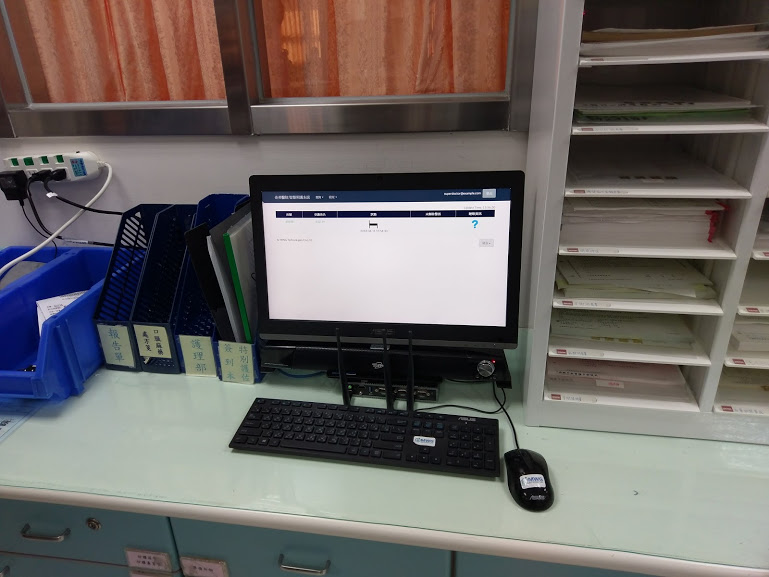
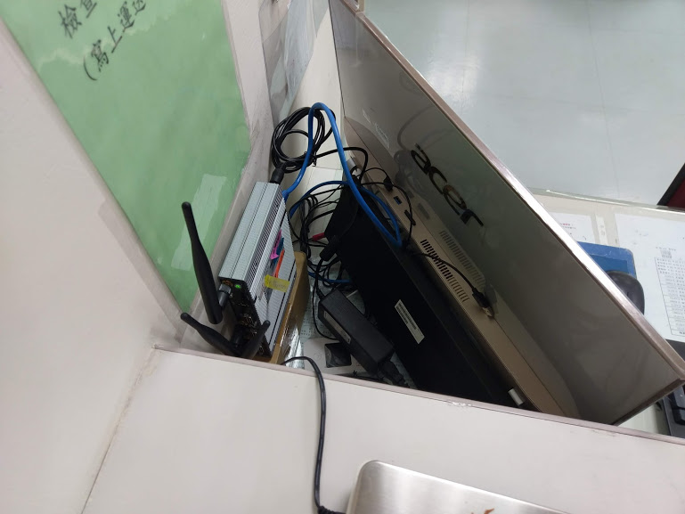
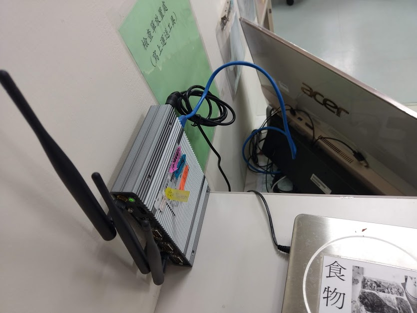
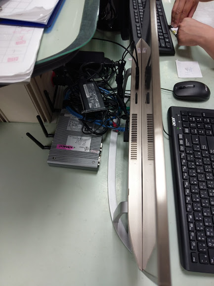
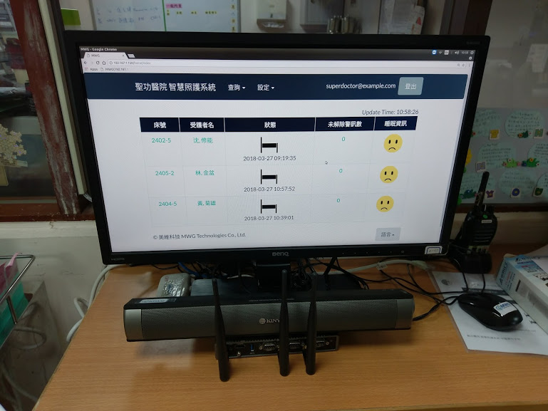

# 2.2 伺服器安裝

## 避免天線靠近水泥牆壁

水泥對訊號會完全阻隔，如果安裝位置剛好遇到水泥牆，可將**天線朝外，且方向朝向安裝智慧墊的病房**。

## 避免天線安裝在螢幕後面

讓天線高於螢幕，防止訊號受螢幕阻隔。

   

## 儘可能讓天線周圍無雜物

伺服器大多安裝在護理站，護理站空間有限，收納不易 \(如下方左圖\)，因此儘量讓天線周圍無雜物或朝外\(如下方右圖\)，減少收訊的干擾。

  

