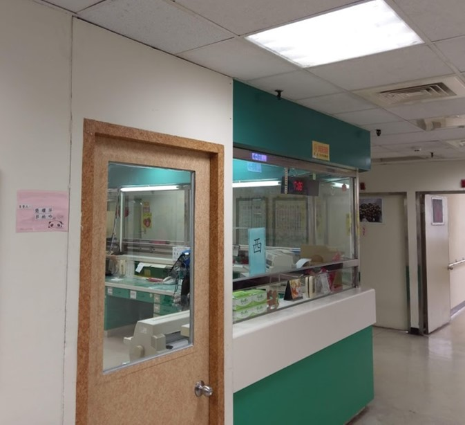

# 3. 收訊不良的原因及對策

## 有玻璃間隔要縮短安裝距離

如果安裝伺服器的護理站，與病區間有玻璃完全間隔，安裝距離需縮短為建議值的**1/2**。\([伺服器與智慧墊的安裝距離](https://billy0727.gitbook.io/guideline/~/edit/drafts/-LVGNiMc0LLwhUULwlYP/zhi-ju)\)

## 伺服器與智慧墊距離太遠

* 將智慧墊的訊號收發器天線更換成5dB。
* 伺服器與智慧墊位置之間加入訊號中繼器。
* 若加入訊號中繼器，收訊距離還是太遠，也可將訊號中繼器的天線換成5dB。

## 伺服器與智慧墊距離近但也收訊不好

* 檢查伺服器、訊號收發器、中繼器天線是否鬆脫。
* 檢查設備天線是否有直立或倒立。
* 安裝的位置，是否有訊號干擾或阻隔物，如：金屬、防火門、玻璃等。
* 變更收訊頻道，避免現場wifi干擾。
* 更換天線。

