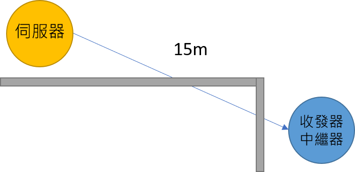
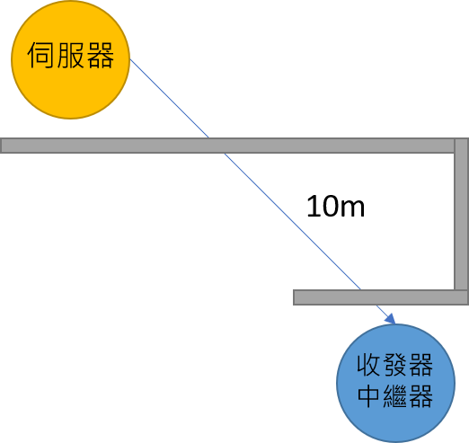

# 1.1 佈置距離

1. 無阻礙直線距離：Server == Node =&gt; 20m \(LQI約120\)
2. 單一轉角距離：Server == Node =&gt; 15m \(LQI約120\)
3. 雙轉角距離：Server == Node =&gt; 10m \(LQI約120\)

### 1. 無阻礙直線距離：Server == Node =&gt; 20m \(LQI約120\)

將伺服器與收發器\(或中繼器\)的位置為直線時，最高收訊距離可達20公尺。

### 2. 單一轉角距離：Server == Node =&gt; 15m \(LQI約120\)

如果伺服器與智慧墊之間位置為L型，且中間牆壁為水泥或金屬阻隔，建議收訊距離為15公尺。

### 3. 雙轉角距離：Server == Node =&gt; 10m \(LQI約120\)

如果伺服器與智慧墊之間位置為U型，且中間牆壁為水泥或金屬阻隔，建議收訊距離為10公尺。

