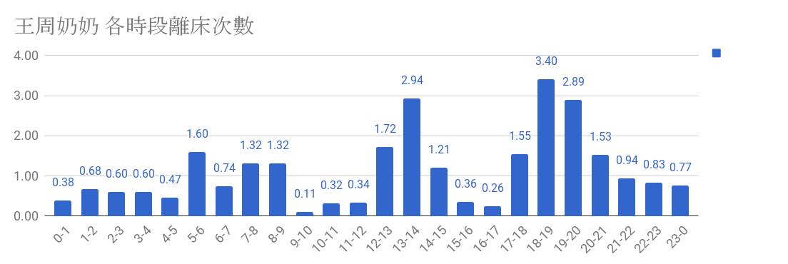

# 佈置距離

1.  無阻礙直線距離：Server == Node =&gt; 20m \(LQI約120\)

   

2.  單一轉角距離：Server == Node =&gt; 15m \(LQI約120\)

   

3. 雙轉角距離：Server == Node =&gt; 10m \(LQI約120\)

## 1. 無阻礙直線距離：Server == Node =&gt; 20m \(LQI約120\)

1. 無阻礙直線距離：Server == Node =&gt; 20m \(LQI約120\)
2. 單一轉角距離：Server == Node =&gt; 15m \(LQI約120\)
3. 雙轉角距離：Server == Node =&gt; 10m \(LQI約120\)

